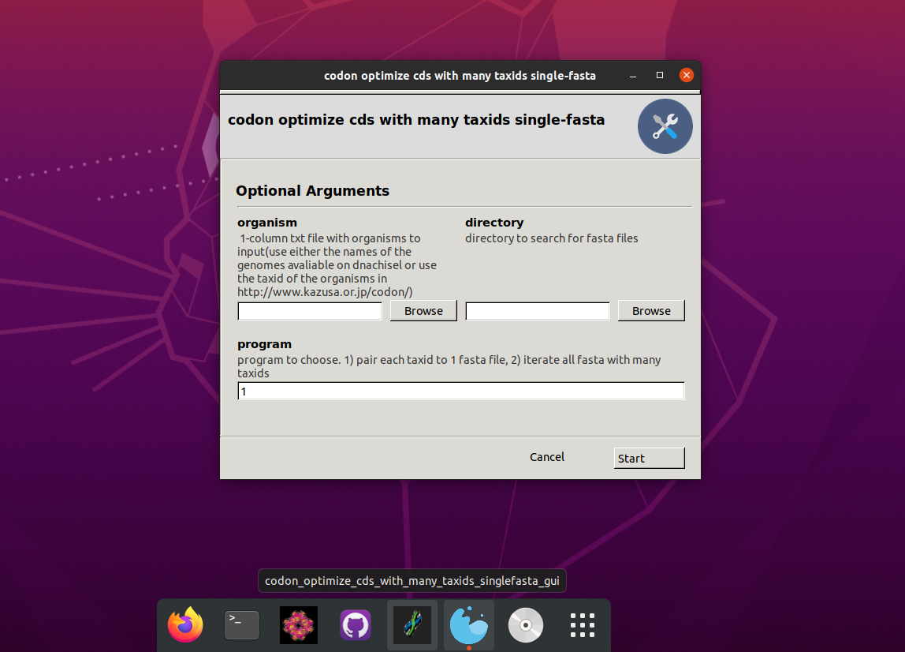

# codon_optimize_cds_with_many_taxids_singlefasta 
Linux GUI app to codon optimize many single-fasta files with coding sequences, using many taxonomy ids

## Depedences
1. linux OS (tested on ubuntu 20.04 LTS)
2. python 3.8.2 or later
3. anaconda or miniconda
4. Gooey `conda install -c conda-forge gooey`(if you get errors during installation or runtime try installing gtk `sudo apt-get install libgtk-3-dev`)
5. biopython `pip install biopython`
6. pandas `pip install pandas`
7. dnachisel `pip install dnachisel`

## linux desktop app installation
1. open a linux text editor and edit in the python file the shebang line (to find where python is type in the terminal `which python3`) 
2. convert to executable with `chmod +x codon_optimize_cds_with_many_taxidS_singlefasta_gui.py`
3. open a linux text editor and edit the PATHs in the `.desktop` file
4. move the file to `/usr/share/applications`
5. reboot your machine

## Output
The output single-fasta files will have the same prefix as the input ones and as suffix the taxonomy ids of the organisms they are codon optimized for

